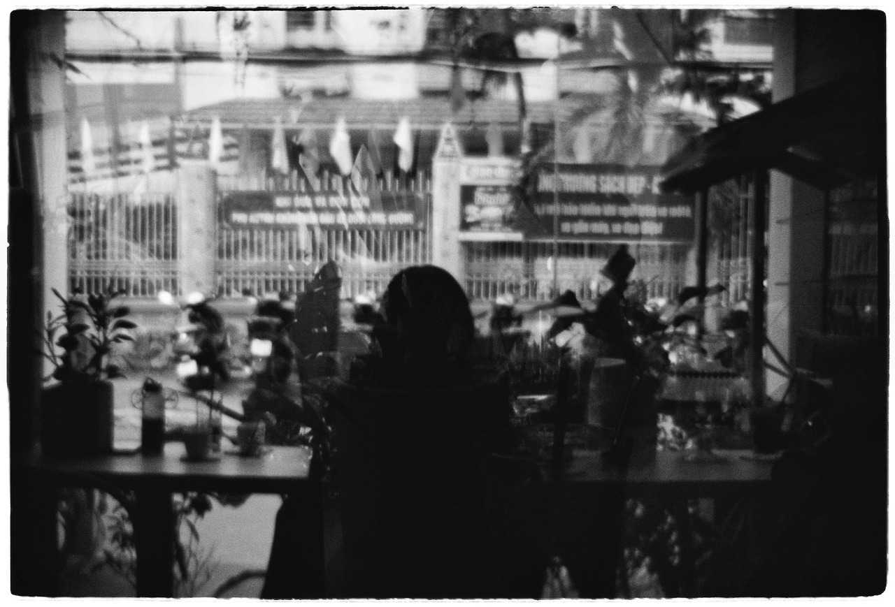

Mình từng nghĩ là, tình yêu gắn liền với cơm áo gạo tiền và một lô một lốc nỗi lo lắng riêng sẽ đơn giản và nhạt nhẽo hơn tình yêu thời sinh viên chứ chưa nói đến thời cấp 3 trẩu tre mơ mộng.

Có lúc mình khách quan mà nghĩ vậy thật.

**Có lúc, mình chỉ tự trấn an mình.** Vì sự thực là mình không thể cảm nhận được cảm giác ấm áp và bình yên của tình yêu nữa. Nhiều chuyện xảy ra, nhiều lần tin tưởng rồi đổ vỡ. Cái gì cũng chẳng thể nói rõ ràng thành lời trước mặt người ta, ừ thì do mình, do cái rào chắn vô hình nào đó mình không thể phá vỡ nổi từ trong nội tâm của mình.

Ngày trước bạn bảo bạn chẳng thể hiểu nổi mình. Tới giờ mình vẫn không quên nổi khi mà mình vẫn không ngừng cố gắng mở lòng với bạn, cũng là cách tự cứu lấy mình. Mình làm sai cách sao?

> Hàng ngày mình tự hỏi, nếu mình yêu 1 ai đó, thực sự mình kỳ vọng gì ở họ, kì vọng điều gì ở mối quan hệ đó để mình có thể thoải mái mà get over mọi chuyện?

Ừ thì, cuối cùng cũng là do mình. Bạn nói đúng, nhưng mà, nói ra vậy có giúp được gì cho mối quan hệ của cả 2 đâu.
