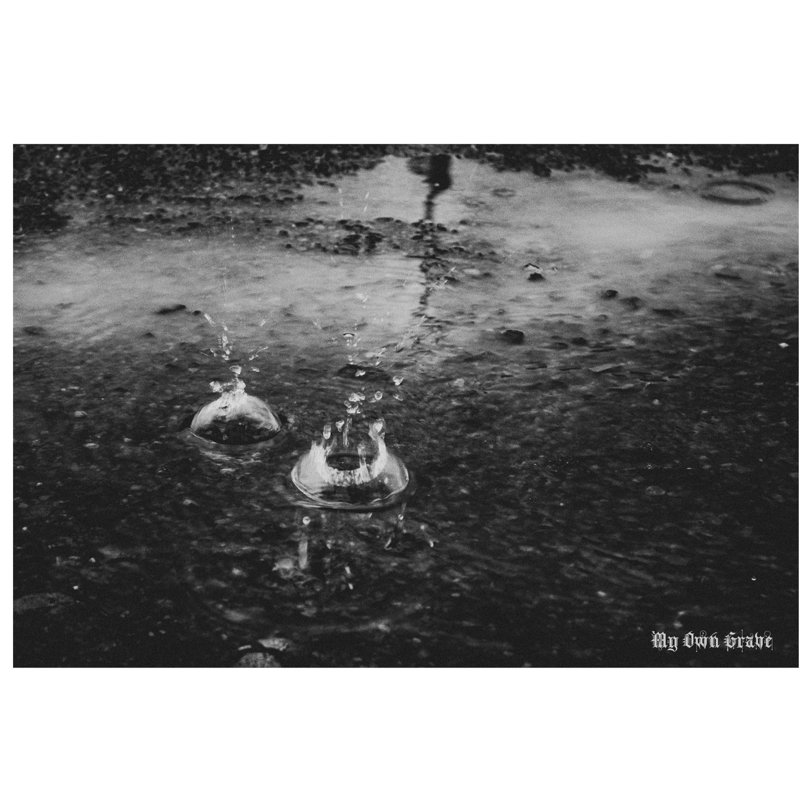

 

#### Mình vốn là đứa không tinh tế và ruột thì để hết ngoài da.

Luôn chỉ có một kịch bản duy nhất mỗi khi một ai đó dành thời gian tâm sự cùng mình, đó là mình lắng nghe (đôi khi hơi lanh chanh vì ngắt lời ng ta), trò chuyện hỏi vài câu để biết thêm và rồi cho người ta lời khuyên, kể câu chuyện tương tự mình từng trải qua, blah blah… nói chung là, mục đích cuối cùng vẫn là cho người ta đáp án hoặc dẫn hướng để tự tìm cho mình lời giải.

Thế nên những khi một ai đấy, tới giờ thì chỉ có duy nhất hai người từng tỏ thái độ như thế này với mình - nổi giận hoặc cáu gắt một cách vô cớ với mình, nghĩ rằng mình áp đặt chỉ vì hiểu chưa đủ (mà thực, đời này làm gì có ai hiểu bạn hơn chính bạn?) hay không như ý muốn của người ta, mình chỉ biết cười trừ tự hỏi, rốt cuộc người ta cần gì ở mình?

Có những chuyện qua rồi nhưng cứ nghĩ đến là tâm tư lại như này như kia, vì sẽ còn gặp nó dài dài.

Và còn nữa, dù biết đối phương quan tâm đó, nhưng mình là một tên nóng nảy, dễ bốc hoả khi cảm thấy mình như đang bị trêu đùa, trong khi lúc đấy mình thực sự nghiêm túc và chân thành. Thực sự, rất không vui.

---

Nhớ lại ngày xưa, còn yêu thì cũng giở cái bài xin lỗi đách vì lý do gì cả ngoài việc anh cần em anh nhớ em anh đã hơi nóng nảy với em, còn sau này, tự nhủ, close enough. Chưa bao giờ hối hận về những gì mình đã làm, về cách mình đã quan tâm người mình từng yêu thương.

#### Làm thằng đàn ông, nên ngang tàng một chút. 

Đừng thay đổi vì phụ nữ muốn, mà vì anh ta thực sự cần như vậy. Phụ nữ họ cằn nhằn bitches đủ kiểu, nhưng cuối cùng thì sinh vật khó hiểu nhất quả đất ấy vẫn cảm thấy muốn ở bên cạnh 1 người đàn ông có lập trường sống vững vàng kia mà.
